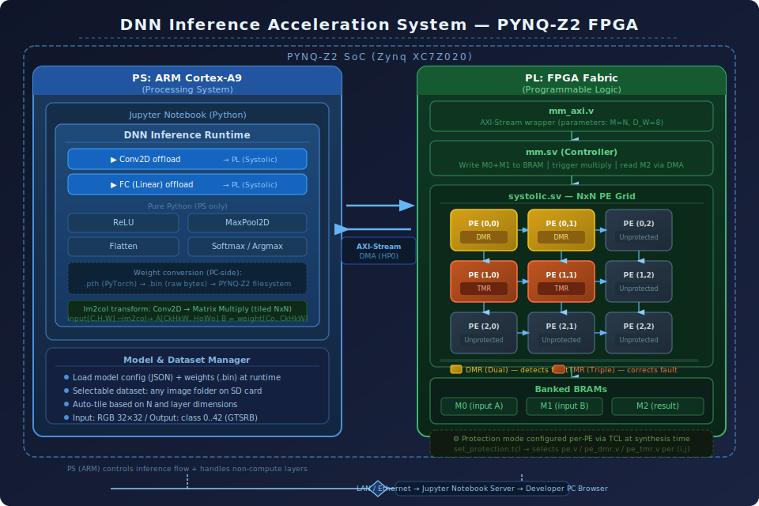

# DNN Inference Acceleration on PYNQ-Z2 FPGA
## System Architecture

---

## 1. Overview

This project implements a DNN inference accelerator on the **PYNQ-Z2** board (Xilinx Zynq XC7Z020), using a PS/PL co-design approach.

| Component | Role | Implementation |
|-----------|------|----------------|
| **PL (FPGA fabric)** | Accelerate `Conv2D` and `Linear (FC)` layers via systolic array matrix multiply | Verilog/SystemVerilog |
| **PS (ARM Cortex-A9)** | Layer scheduling, tiling, DMA control, and all non-linear operations | Pure Python (no PyTorch/NumPy) |

> **Constraint**: The PYNQ-Z2 embedded Linux does not include PyTorch, NumPy, or similar libraries. All PS-side computation is implemented in pure Python.

---

## 2. PL Hardware — Systolic Array Accelerator

### 2.1 Source Modules

| File | Role |
|------|------|
| `pe.v` | Output-Stationary PE: MAC unit, passes A horizontally and B vertically, accumulates partial sum internally |
| `pe_unpipelined.v` | Un-pipelined PE variant |
| `systolic.sv` | NxN PE grid; generates diagonal `init` wavefront to stagger PE activation |
| `mm.sv` | Controller: banked BRAM (M0/M1/M2), AXI-Stream I/O, memory read/write sequencing |
| `mm_axi.v` | AXI-Stream wrapper for `mm.sv` |
| `mem_read_m0.sv` / `mem_read_m1.sv` | BRAM address generators for input matrices |
| `mem_write.sv` | BRAM address generator for output matrix |

### 2.2 Parameters

```
N   = systolic array dimension (NxN PEs)   — set at build time via TCL
M   = N                                    — FIXED (M = N, input matrix dimension)
D_W = 8 bits                               — INT8 fixed-point
```

For layers with matrices larger than N×N, the PS tiles the computation across multiple invocations.

### 2.3 Dataflow Strategies

Three dataflow modes are supported. The mode is selected in `design_config.tcl` and resolved at synthesis time via TCL — no source code changes required between builds.

#### Output Stationary (OS) — default, matches `pe.v`

Each PE accumulates its own partial sum internally across N multiply-accumulate steps. A (activation) streams horizontally, B (weight) streams vertically, and the output C resides in the PE until flushed.

```
PE register: out_tmp  (partial sum stays in PE)
init = 1  →  flush out_tmp to output chain, start new accumulation
init = 0  →  out_tmp += in_a * in_b
Results exit from the rightmost output chain column.
```

Best for: large-kernel convolutions where each output element benefits from long accumulation runs.

#### Weight Stationary (WS) — `pe_ws.v`

Weights B are pre-loaded once into PE registers during a load phase. Activations A then stream through, and partial sums accumulate via the horizontal data chain (`in_data → out_data`), exiting from the rightmost column each compute cycle.

```
PE register: w_reg  (weight stays in PE across all activation inputs)
init = 1  →  w_reg <= in_b  (load weight from vertical wire)
init = 0  →  out_data = in_data + in_a * w_reg  (psum flows right)
Results exit from rightmost column per compute step.
```

Best for: FC layers and small kernels with large batch sizes — weight memory accesses are minimised.

#### Input Stationary (IS) — `pe_is.v`

Activations A are pre-loaded once into PE registers. Weights B then stream vertically, and partial sums accumulate via the horizontal chain. Effectively computes A × B^T; if A×B is needed, pre-transpose B in software before sending to PL.

```
PE register: a_reg  (activation stays in PE across all weight inputs)
init = 1  →  a_reg <= in_a  (load activation from horizontal wire)
init = 0  →  out_data = in_data + a_reg * in_b  (psum flows right)
Results exit from rightmost column per compute step.
```

Best for: convolutional layers with large feature maps — activation memory accesses are minimised.

#### Dataflow Comparison

| | OS | WS | IS |
|--|--|--|--|
| Stationary element | Output psum | Weight B | Input A |
| PE register | `out_tmp` | `w_reg` | `a_reg` |
| `init=1` action | Flush psum | Load weight | Load activation |
| Memory: A reads | N per element | N per element | **1 (loaded once)** |
| Memory: B reads | N per element | **1 (loaded once)** | N per element |
| Result path | Internal → chain | Chain (flows right) | Chain (flows right) |
| Config variable | `"OS"` | `"WS"` | `"IS"` |

---

## 3. PE Protection Mechanisms

Each PE can be individually protected. The protection mode is set per-PE coordinate `(row, col)` in `design_config.tcl` and is applied at synthesis time by the TCL gen script.

### DMR — Dual Modular Redundancy

```
              ┌─────────┐
Input ───────►│  PE_a   │──►┐
              └─────────┘   │   ┌────────────┐
                            ├──►│ Comparator │──► Output (from PE_a)
              ┌─────────┐   │   │            │──► error_flag (if mismatch)
Input ───────►│  PE_b   │──►┘   └────────────┘
              └─────────┘
```

- Resource overhead: ~2× per protected PE
- Detects single-PE fault; cannot correct
- Raises `error_flag` — monitored by PS via AXI GPIO

### TMR — Triple Modular Redundancy

```
              ┌─────────┐
Input ───────►│  PE_a   │──►┐
              └─────────┘   │
              ┌─────────┐   │   ┌──────────────┐
Input ───────►│  PE_b   │───┼──►│ Majority Voter│──► Corrected Output
              └─────────┘   │   │   (2 of 3)   │
              ┌─────────┐   │   └──────────────┘
Input ───────►│  PE_c   │──►┘
              └─────────┘
```

- Resource overhead: ~3× per protected PE
- Corrects single-PE fault silently; no error flag
- Voter uses bitwise 2-of-3 majority logic

### Protection × Dataflow Matrix

The protection wrappers are provided for all three dataflow PE types:

| Base PE | DMR wrapper | TMR wrapper |
|---------|------------|------------|
| `pe.v` (OS) | `pe_dmr.v` | `pe_tmr.v` |
| `pe_ws.v` (WS) | `pe_ws_dmr.v` | `pe_ws_tmr.v` |
| `pe_is.v` (IS) | `pe_is_dmr.v` | `pe_is_tmr.v` |

---

## 4. System Architecture Diagram



> **Legend:**
> - 🟠 **TMR** — corrects single-PE fault (3× PE + voter)
> - 🟡 **DMR** — detects fault, raises `error_flag` (2× PE + comparator)
> - ⬜ **Unprotected** — single PE, no redundancy
> - **AXI-Stream DMA (HP0)** — high-bandwidth data path between PS DDR3 and PL

---

## 5. Automated Build System (Vivado TCL)

The entire PL build is automated via a set of TCL scripts located in `vivado_build/`. A single command generates the bitstream from scratch with no manual Vivado GUI interaction.

### 5.1 Build Folder Structure

```
vivado_build/
├── config/
│   └── design_config.tcl        ← USER edits this (N, D_W, dataflow, protection map)
├── tcl/
│   ├── run_all.tcl              ← Entry point: sources config, calls all steps in sequence
│   ├── 01_gen_protected_rtl.tcl ← Reads config → generates systolic_protected.sv
│   ├── 02_create_project.tcl    ← Creates Vivado project, adds all RTL and IP sources
│   ├── 03_create_bd.tcl         ← Builds Block Design: Zynq PS7 + DMA + mm_eval + GPIO
│   └── 04_synth_impl.tcl        ← Synthesis → Implementation → Bitstream → copy to output/
├── rtl/
│   ├── pe_dmr.v / pe_tmr.v          (OS protection wrappers)
│   ├── pe_ws.v / pe_ws_dmr.v / pe_ws_tmr.v  (WS PE and protection wrappers)
│   ├── pe_is.v / pe_is_dmr.v / pe_is_tmr.v  (IS PE and protection wrappers)
│   ├── mm_protected.sv               (controller using systolic_protected)
│   └── mm_protected_axi.v            (AXI-Stream wrapper + fault_detected port)
├── generated/
│   └── systolic_protected.sv    ← AUTO-GENERATED by 01_gen_protected_rtl.tcl
├── constraints/
│   └── pynq_z2.xdc
└── output/
    ├── pynq_z2_system.bit
    └── pynq_z2_system.hwh
```

> The `generated/` and `output/` folders are created automatically. The original source directory is not modified.

### 5.2 User Configuration (`design_config.tcl`)

All build-time parameters are set in one file:

```tcl
set DESIGN_N         4       # Systolic array dimension (NxN)
set DESIGN_D_W       8       # Data width (bits)
set DESIGN_DATAFLOW  "OS"    # Dataflow: OS | WS | IS

set PE_PROTECTION_MAP {
    {0 0 TMR}   {0 1 TMR}   {0 2 DMR}   {0 3 DMR}
    {1 0 TMR}   {1 1 DMR}   {1 2 none}  {1 3 none}
    {2 0 DMR}   {2 1 none}  {2 2 none}  {2 3 none}
    {3 0 none}  {3 1 none}  {3 2 none}  {3 3 none}
}
```

Any PE not listed defaults to `none`. The map is resolved at synthesis time.

### 5.3 Build Execution

```bash
# Source Vivado 2022.2 environment
source /path/to/xilinx.vivado.2022.2.csh

# Run full build (batch mode)
vivado -mode batch \
       -source vivado_build/tcl/run_all.tcl \
       -log vivado_build/output/vivado.log
```

**What `run_all.tcl` does:**

1. Sources `design_config.tcl` → sets `DESIGN_N`, `DESIGN_D_W`, `DESIGN_DATAFLOW`, `PE_PROTECTION_MAP`
2. Calls `01_gen_protected_rtl.tcl` → generates `systolic_protected.sv` with correct PE types per position
3. Calls `02_create_project.tcl` → creates Vivado project, adds all `.v`/`.sv` files, generates `blk_mem_gen_0` IP
4. Calls `03_create_bd.tcl` → builds Zynq PS7 + AXI DMA (HP0) + `mm_protected_axi` + AXI GPIO (fault status)
5. Calls `04_synth_impl.tcl` → runs synthesis, implementation, bitstream; copies `.bit`/`.hwh` to `output/`

### 5.4 Generated `systolic_protected.sv`

`01_gen_protected_rtl.tcl` reads the protection map and dataflow setting, then writes `systolic_protected.sv` with explicit per-PE instantiation:

```
DESIGN_DATAFLOW = "OS", protection map entry (0,0) = TMR:
  → pe_tmr  #(.D_W(D_W),.i(0),.j(0)) pe_0_0 (...)

DESIGN_DATAFLOW = "WS", protection map entry (0,2) = DMR:
  → pe_ws_dmr #(.D_W(D_W),.i(0),.j(2)) pe_0_2 (..., .error_flag(fault_0_2))

DESIGN_DATAFLOW = "IS", protection map entry (1,1) = none:
  → pe_is #(.D_W(D_W),.i(1),.j(1)) pe_1_1 (...)
```

All DMR `error_flag` signals are OR-reduced to a single `fault_flag` output, which is routed through `mm_protected.sv → mm_protected_axi.v` to an AXI GPIO register readable by the PS.

### 5.5 Block Design (Vivado IP Integrator)

```
GP0 (MMIO) ──► AXI Interconnect ──► AXI DMA (ctrl registers)
                                 └──► AXI GPIO (fault_detected)

HP0 (DMA)  ◄── AXI SmartConnect ◄── AXI DMA M_AXI_MM2S
                                 ◄── AXI DMA M_AXI_S2MM

AXI DMA M_AXIS_MM2S ──► mm_protected_axi (x_ input stream)
mm_protected_axi (y_ output stream) ──► AXI DMA S_AXIS_S2MM

mm_protected_axi.fault_detected ──► AXI GPIO gpio_io_i
```

### 5.6 Vivado Version Compatibility

| Version | Status |
|---------|--------|
| **2022.2** | Primary target |
| **2025.1** | Compatible |
| **2021.1** | Likely compatible (SmartConnect API may differ) |
| **2020.2** | May require replacing SmartConnect with AXI Interconnect |

---

## 6. Data Flow: DNN Layer Execution

### Accelerated Layers — Conv2D and FC

```
PS                                            PL
│                                              │
│  1. im2col transform (Conv2D → GEMM)        │
│     reshape weights → B matrix              │
│  2. Tile: split into NxN blocks             │
│  3. DMA send → AXI-Stream ────────────────►│
│                                             │ 4. Receive into BRAM M0, M1
│                                             │ 5. systolic_protected computes M0×M1
│                                             │    (dataflow per DESIGN_DATAFLOW)
│  8. Reassemble output tiles         ◄───────│ 6. Write result to BRAM M2
│  9. Feed into next layer            ◄───────│ 7. DMA send ← AXI-Stream
│  10. Check fault_detected via GPIO          │
│                                              │
```

### PS-Only Layers

```
ReLU:      output[i] = max(0, input[i])
MaxPool2D: sliding window max (pure Python loops)
Flatten:   3D list reshape → 1D list
Softmax:   exp(x_i) / sum(exp(x_j))
Argmax:    index of maximum logit
```

---

## 7. PS Software Stack

All PS code runs in pure Python on the ARM Cortex-A9 (embedded Linux, no NumPy/PyTorch).

```
dnn_runtime/
├── tensor.py             # List-based tensor class
├── layers/
│   ├── conv.py           # im2col → tile → DMA loop → PL
│   ├── fc.py             # Weight tile → DMA loop → PL
│   ├── relu.py           # ReLU (pure Python)
│   ├── maxpool.py        # MaxPool2D (pure Python)
│   ├── flatten.py        # Reshape (pure Python)
│   └── softmax.py        # Softmax (pure Python)
├── model_loader.py       # Load JSON config + binary .bin weights
├── dataset_loader.py     # Load image folders from SD card
├── pl_interface.py       # PYNQ DMA driver + AXI GPIO (fault monitor)
└── inference.py          # End-to-end pipeline
```

**Weight loading**: PyTorch `.pth` files are converted offline (on PC) to INT8 raw binary `.bin` using a conversion script. On PYNQ-Z2, `model_loader.py` reads these directly.

**im2col**: Converts Conv2D into GEMM. The resulting matrix is tiled into NxN blocks, each sent to PL via DMA.

**Fault monitoring**: `pl_interface.py` reads the AXI GPIO register after each DMA transaction. If `fault_detected=1`, the event is logged. The PS may retry the tile or flag the result as uncertain.

---

## 8. Deployment Flow

```
Developer PC
    │
    │  1. Edit vivado_build/config/design_config.tcl
    │     (set N, dataflow, protection map)
    │  2. Run: vivado -mode batch -source vivado_build/tcl/run_all.tcl
    │     → vivado_build/output/pynq_z2_system.bit + .hwh
    │  3. Convert weights: python convert_weights.py model.pth → weights.bin
    │  4. scp *.bit *.hwh *.bin  xilinx@<board_ip>:/home/xilinx/
    │
    ▼
PYNQ-Z2 Board  ──── Ethernet LAN ────  Browser (Jupyter)
    │
    │  5. ol = Overlay('pynq_z2_system.bit')
    │  6. Run inference via dnn_runtime
    │     Conv/FC → DMA → PL systolic array
    │     ReLU/Pool/Flatten → PS Python
    │  7. Read fault_gpio; log fault events
    │  8. Display classification result
```

---

## 9. Phase 1 Model — TrafficSignNetSmall

| Layer | Type | Input | Output | Execution |
|-------|------|-------|--------|-----------|
| conv1 | Conv2D 3→16, k=3 | [3,32,32] | [16,32,32] | ✅ PL |
| conv2 | Conv2D 16→16, k=3 | [16,32,32] | [16,32,32] | ✅ PL |
| pool1 | MaxPool 2×2 | [16,32,32] | [16,16,16] | PS |
| conv3 | Conv2D 16→32, k=3 | [16,16,16] | [32,16,16] | ✅ PL |
| conv4 | Conv2D 32→32, k=3 | [32,16,16] | [32,16,16] | ✅ PL |
| pool2 | MaxPool 2×2 | [32,16,16] | [32,8,8] | PS |
| conv5 | Conv2D 32→64, k=3 | [32,8,8] | [64,8,8] | ✅ PL |
| conv6 | Conv2D 64→64, k=3 | [64,8,8] | [64,8,8] | ✅ PL |
| pool3 | MaxPool 2×2 | [64,8,8] | [64,4,4] | PS |
| flatten | Flatten | [64,4,4] | [1024] | PS |
| fc1 | Linear 1024→256 | [1024] | [256] | ✅ PL |
| relu | ReLU | [256] | [256] | PS |
| fc2 | Linear 256→128 | [256] | [128] | ✅ PL |
| relu | ReLU | [128] | [128] | PS |
| fc3 | Linear 128→43 | [128] | [43] | ✅ PL |
| output | Argmax | [43] | class [0..42] | PS |

- **Weights**: `traffic_sign_net_small_final_93.89pct.pth` → converted to `.bin` offline
- **Dataset**: GTSRB, 43 classes, 32×32 RGB input

---

## 10. Configuration Summary

| Parameter | How it is set | When resolved |
|-----------|---------------|---------------|
| Array size N | `design_config.tcl` | Build time (TCL) |
| Matrix size M | Fixed = N | Build time |
| Dataflow (OS/WS/IS) | `DESIGN_DATAFLOW` in `design_config.tcl` | Build time (gen script) |
| PE protection per (i,j) | `PE_PROTECTION_MAP` in `design_config.tcl` | Build time (gen script) |
| DNN model | model JSON + `.bin` files | Runtime (PS) |
| Dataset | Image folder on SD card | Runtime (PS) |
| Tile schedule | Auto-computed from N and layer dims | Runtime (PS) |

---

## 11. Implementation Status

| Phase | Deliverable | Status |
|-------|-------------|--------|
| 0 | Architecture documentation (v1, v2) | ✅ |
| 1a | `pe_dmr.v`, `pe_tmr.v` (OS protection wrappers) | ✅ |
| 1b | `pe_ws.v`, `pe_ws_dmr.v`, `pe_ws_tmr.v` (WS dataflow) | ✅ |
| 1c | `pe_is.v`, `pe_is_dmr.v`, `pe_is_tmr.v` (IS dataflow) | ✅ |
| 1d | `mm_protected.sv`, `mm_protected_axi.v` | ✅ |
| 2 | Vivado TCL build automation (`run_all.tcl` + sub-scripts) | ✅ |
| 2a | `01_gen_protected_rtl.tcl` → auto-generates `systolic_protected.sv` | ✅ |
| 2b | `02_create_project.tcl` → Vivado project + IP | ✅ |
| 2c | `03_create_bd.tcl` → Block Design (Zynq + DMA + GPIO) | ✅ |
| 2d | `04_synth_impl.tcl` → Synthesis + Implementation + Bitstream | ✅ |
| 3 | Weight conversion script (PC-side, PyTorch → `.bin`) | 🔲 |
| 4 | Pure Python DNN runtime (tensor, layers, im2col, tiling) | 🔲 |
| 5 | `pl_interface.py` — DMA driver + fault GPIO monitor | 🔲 |
| 6 | Jupyter Notebook end-to-end inference demo | 🔲 |
| 7 | Validation: PL result vs Python golden reference | 🔲 |

---

*Target board: PYNQ-Z2 (Xilinx Zynq XC7Z020)*
*Model: TrafficSignNetSmall — 93.89% accuracy on GTSRB*
*Build tool: Vivado 2022.2 (batch TCL mode)*
