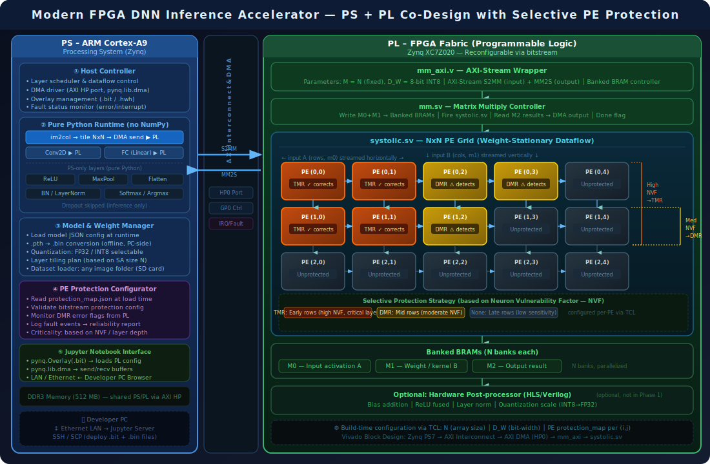

# Cấu trúc Hệ thống Gia tốc Suy luận DNN — Phiên bản V2 (Có bảo vệ PE chọn lọc)

---

## 1. Tổng quan Kiến trúc Đề xuất (Phiên bản V2)

Dựa trên sự phát triển của các hệ thống gia tốc phần cứng hiện đại cho Edge AI (Hybrid PS+PL), phiên bản V2 của hệ thống tập trung vào việc **tối ưu hóa luồng dữ liệu (dataflow)**, **giảm thiểu truy cập bộ nhớ ngoài**, và **tích hợp cơ chế bảo vệ PE có chọn lọc do người dùng định nghĩa**.

Kiến trúc V2 tận dụng tối đa sức mạnh của FPGA PL để tính toán các phép toán ma trận nặng, trong khi ARM PS đóng vai trò điều phối tổng thể và xử lý các lớp nhẹ.

---

## 2. Sơ đồ Kiến trúc Hệ thống



> **Chú giải:**
> - 🟠 **TMR** (Cam) — Triple Modular Redundancy: 3 bản sao PE, tự động sửa lỗi thông qua bộ bỏ phiếu đa số (Majority Voter).
> - 🟡 **DMR** (Vàng) — Dual Modular Redundancy: 2 bản sao PE, phát hiện lỗi thông qua bộ so sánh (Comparator) và xuất cờ báo lỗi.
> - ⬜ **Unprotected** (Xám) — PE tiêu chuẩn, không có phần cứng dự phòng.
> - Cơ chế bảo vệ **áp dụng cho PE nào là do người dùng quyết định** dựa trên mô hình và tính chất ứng dụng.

---

## 3. Các Cải tiến Kiến trúc Cốt lõi của V2

Để đạt được hiệu suất cao trên thiết bị edge như PYNQ-Z2, kiến trúc V2 thiết kế vượt ra ngoài việc chỉ offload phép nhân ma trận đơn giản:

### 3.1 Cấu trúc Bộ nhớ 3 Cấp độ (3-Level Memory Hierarchy)

Hệ thống sử dụng hệ thống bộ nhớ phân cấp để tối ưu hóa việc tái sử dụng dữ liệu và giảm tối đa giao tiếp với RAM DDR3 chậm chạp:

1. **Level 1: Thanh ghi nội bộ của PE (Trực tiếp tính toán)**
   - Lưu trữ các tổng thành phần (partial sums) ngay bên trong PE trong suốt quá trình tích lũy cho một tile.
   - Không cần ghi/đọc BRAM cho mỗi phép nhân-cộng (MAC).

2. **Level 2: BRAM phân bank trên chip (RAM On-chip — M0, M1, M2)**
   - M0 chứa dữ liệu kích hoạt (activations), M1 chứa trọng số (weights), M2 chứa kết quả.
   - Có *N* block RAM song song cho mỗi ma trận, cho phép nạp dữ liệu vào toàn bộ 1 hàng/cột của Systolic Array trong 1 chu kỳ xung nhịp.

3. **Level 3: Bộ nhớ DDR3 ngoài chip (DRAM qua AXI DMA)**
   - Lưu trữ toàn bộ trọng số của mô hình và các feature map trung gian.
   - Dữ liệu được truyền qua cổng AXI HP (High-Performance) bằng cơ chế DMA để đạt băng thông tối đa. Truy cập được giảm thiểu thông qua chiến lược chia nhỏ (Tiling).

---

### 3.2 Kỹ thuật Double-Buffering (Ping-Pong BRAM)

Để loại bỏ thời gian rảnh rỗi chờ DMA truyền dữ liệu, hệ thống V2 sử dụng **Double-Buffering**:
- BRAM được chia thành 2 bộ: Set A và Set B.
- Trong khi Systolic Array đang bận rộn tính toán dữ liệu ở Set A, PS sẽ dùng DMA để nạp sẵn dữ liệu của Tile tiếp theo vào Set B.
- Cơ chế "Ping-Pong" này cho phép **chồng lấp (overlap)** thời gian tính toán và thời gian truyền Dữ liệu, đẩy Throughput của hệ thống lên mức tối đa.

---

### 3.3 Layer Fusion (Gộp lớp tính toán) sau Hware

Thay vì gửi kết quả ngược về PS chỉ để tính hàm kích hoạt (Activation) rồi lại gửi xuống PL cho lớp tiếp theo, kiến trúc V2 hỗ trợ **Layer Fusion** (khối HLS Post-processor tự chọn ở đầu ra M2).

- Gộp phép tính Bias, BatchNorm, và hàm kích hoạt (ví dụ: ReLU).
- Quá trình này diễn ra streaming ngay khi dữ liệu rời khỏi BRAM M2 trước khi ghi vào DMA, giúp **giảm 30-40% lưu lượng truyền tải DMA** giữa PS và PL.

---

## 4. Cơ chế Bảo vệ PE Có Chọn Lọc (Do User Tùy Chỉnh)

Điểm cốt lõi của đề tài là việc áp dụng bảo vệ phần cứng (TMR, DMR) lên mạng Systolic Array. Khác với việc bảo vệ toàn bộ (Full TMR) gây tốn kém 300% tài nguyên, hệ thống V2 cung cấp **cơ chế cấu hình mềm dẻo hoàn toàn do người dùng quyết định**.

### 4.1 Triết lý Thiết kế: User-Driven Protection

Tính quan trọng của mỗi PE (ví dụ: PE nằm ở các hàng đầu tiên hoặc tính toán cho các channel quan trọng của ảnh) thay đổi hoàn toàn phụ thuộc vào:
1. **Kiến trúc mô hình DNN** (ví dụ: ResNet khác với TrafficSignNet).
2. **Yêu cầu an toàn của ứng dụng** (ví dụ: nhận diện y tế cần TMR cho các lớp đầu, ứng dụng IoT có thể chỉ cần DMR).
3. **Ngân sách tài nguyên FPGA** (Pynq-Z2 có giới hạn LUTs và DSPs).

Do đó, **hệ thống không fix cứng sơ đồ bảo vệ**. Thay vào đó, user có toàn quyền tự do ánh xạ chiến lược bảo vệ thông qua cấu hình TCL.

### 4.2 Cấu hình Thông qua TCL khi Build

Người dùng sẽ định nghĩa mapping bảo vệ tại thời điểm tổng hợp (Synthesis) thông qua một file kịch bản TCL (ví dụ: `set_protection.tcl`). Kịch bản này sẽ cấu hình Systolic Array module instantiations.

Ví dụ cấu hình cho lưới 4x4 (chỉ mang tính chất minh họa):

```tcl
# Cấu hình kích thước SA
set N 4

# Map tùy chọn bảo vệ do USER cấp dựa trên phân tích mô hình của họ
# Định dạng: {row col mode} — mode: none | DMR | TMR
set pe_protection_map {
    {0 0 TMR}  {0 1 TMR}  {0 2 DMR}  {0 3 DMR}
    {1 0 TMR}  {1 1 TMR}  {1 2 DMR}  {1 3 none}
    {2 0 DMR}  {2 1 DMR}  {2 2 none} {2 3 none}
    {3 0 none} {3 1 none} {3 2 none} {3 3 none}
}
```

Dựa vào danh sách trên, khối `generate` trong Verilog sẽ tự động:
- Gọi `pe.v` cho vị trí `none`.
- Gọi `pe_dmr.v` (kèm logic so sánh) cho vị trí `DMR`.
- Gọi `pe_tmr.v` (kèm logic voter) cho vị trí `TMR`.

### 4.3 Giám sát Lỗi (Fault Monitoring) tại Runtime

Trong khi TMR tự động sửa lỗi và trong suốt với phần mềm, thì DMR chỉ phát hiện lỗi và báo cờ.
- **Tại PL:** Các tín hiệu báo lỗi từ tất cả PE DMR được tổng hợp lại (OR) và kết nối với một thanh ghi trạng thái (Status Register) trên giao tiếp AXI-Lite.
- **Tại PS (Python):** `pl_interface.py` sẽ liên tục đọc thanh ghi này. Khi có lỗi DMR xảy ra, người dùng có quyền lập trình kịch bản phản hồi ở mức Software:
  1. Ghi log sự kiện (phục vụ đánh giá độ tin cậy).
  2. Bỏ qua nếu ứng dụng chấp nhận sai số.
  3. Cảnh báo "Kết quả dự đoán có độ tin cậy thấp" ra UI.

---

## 5. Cấu trúc Phần Mềm Môi trường PS (Python)

Toàn bộ quá trình inference được điều phối trên PS bằng **Python thuần** (không dùng PyTorch/NumPy):

### 5.1 Xử lý Tensor & Tiling
Do `M=N` là hằng số cố định của phần cứng, phần mềm PS phải thực hiện chia nhỏ (tiling) các lớp Convolution và Fully Connected lớn thành lưới các block `NxN`.

- **Conv2D via im2col**: Phần mềm tự động chuyển đổi các lớp tích chập Conv2D thành các bài toán nhân ma trận lớn (im2col), sau đó cắt nhỏ thành các khối `NxN` và đẩy lần lượt vào bộ DMA.

### 5.2 Quản lý Mô hình và Trọng số (Any Dataset, Any Model)
Kiến trúc cho phép tùy chọn load bất kỳ tập dữ liệu và bộ trọng số nào (với điều kiện phù hợp với kiến trúc tính toán SA):

- **Offline (Trên PC):** Script Python đọc file `.pth` (ví dụ của mô hình Traffic Sign Net) và parse các parameters, xuất ra file nhị phân `.bin` dưới dạng INT8 (hoặc chuẩn định nghĩa trước).
- **Online (Trên PYNQ):** Sinh sinh một class `ModelManager` để load các file cấu hình và `.bin`, sau đó nạp trọng số qua DMA / BRAM đối với từng lớp trong quá trình inference.

Các lớp còn lại như *MaxPool*, *Flatten*, và *Softmax* có độ phức tạp tính toán O(N) thấp nên được thực thi trực tiếp bằng CPU ARM trên PS.

---

## 6. Lộ trình Thực Hiện Cập Nhật (Roadmap)

| Giai đoạn | Hạng mục | Vị trí thực hiện | Trạng thái |
|-----------|----------|------------------|------------|
| **Phase 1** | Hoàn thiện Module HW: code `pe_dmr.v`, `pe_tmr.v` và tạo bộ khung `generate` trong `systolic.sv` nhận tham số cấu hình tĩnh. | Verilog (PL) | 🔲 |
| **Phase 2** | Viết kịch bản TCL: `set_protection.tcl`, `create_project.tcl`, `create_bd.tcl` để build tự động PS+PL. | TCL / Vivado | 🔲 |
| **Phase 3** | Cập nhật HW Controller: Nâng cấp `mm.sv` hỗ trợ cơ chế Double Buffering và AXI-Lite Status register báo lỗi. | Verilog (PL) | 🔲 |
| **Phase 4** | Script convert model PC: Parse `traffic_sign_net_small.pth` xuất ra file weights định dạng raw binary `.bin`. | Python (PC) | 🔲 |
| **Phase 5** | Xây dựng Python Inference Runtime: Hàm `im2col`, chia Tiling, DMA transfer via `pynq`, và các lớp MaxPool/Softmax/Hàm quản lý lỗi DMR. | Python (PYNQ PS) | 🔲 |
| **Phase 6** | Tích hợp & Demo trên Jupyter Notebook: Chạy nhận diện biển báo giao thông End-to-End. Đọc tập dữ liệu mẫu. | Python (PYNQ PS) | 🔲 |
| **Phase 7** | Đánh giá System Verification: So sánh kết quả tính toán trên board với kết quả PyTorch reference ban đầu. | Python / Log | 🔲 |

---

*Tài liệu Phiên bản V2: Cấu trúc hệ thống trọng tâm với Cơ chế Bảo vệ PE cấu hình bởi Người dùng.*  
*Thiết bị mục tiêu: PYNQ-Z2 (Zynq XC7Z020).*  
*Model Phase 1: TrafficSignNetSmall (Đã đào tạo)*
